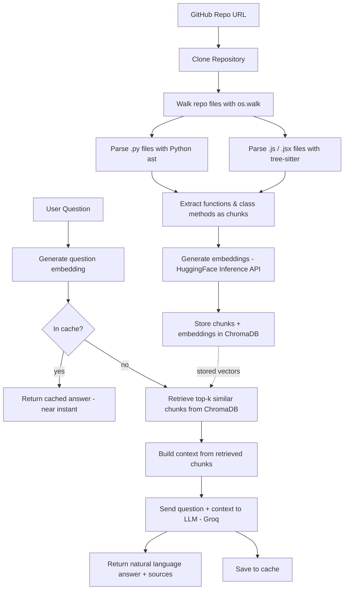

# RepoMind — Intelligent Repository Navigation

RepoMind lets you point at any public GitHub repository and ask questions about it in plain English. It clones the repo, breaks the code down into functions, class methods, and (for JS/JSX) arrow functions using AST/tree-sitter parsing, embeds each chunk, stores them in a vector database, and answers your questions using a RAG (Retrieval-Augmented Generation) pipeline — with real code as context.

Unlike simple PDF/document RAG tools, RepoMind understands **code structure**. Chunks are never split mid-function — every chunk is a complete function or method, so retrieved context is always coherent. It also understands more than one language: both **Python** and **JavaScript/JSX** codebases are parsed structurally, not just text-split.

The system's reliability isn't just assumed — it's measured. Evaluated with the [RAGAS](https://github.com/explodinggradients/ragas) framework on a custom benchmark, RepoMind achieves **91–98% faithfulness** and **~88% answer relevancy**, with **~1.45s average end-to-end response time** (near-instant on repeated queries, thanks to caching).

A live chat interface is included, and the whole app is deployable as a single service.

---

## How It Works



**Indexing pipeline** (`POST /index`): Clone → Chunk (AST / tree-sitter) → Embed → Store
**Query pipeline** (`POST /ask`): Check cache → Embed question → Retrieve similar chunks → Generate answer with LLM → Cache result

---

## Features

- 🔍 **AST/tree-sitter-based code chunking** — splits code at function/class-method boundaries, never mid-function
- 🌐 **Multi-language support** — Python (via the `ast` module) and JavaScript/JSX (via `tree-sitter`), including standalone functions, class methods, and arrow functions
- 🧠 **Semantic search** — finds relevant code by meaning, not just keyword matching
- 💬 **Natural language Q&A** — ask questions like "how does authentication work?" and get a real answer with code references
- 📁 **Recursive repo scanning** — automatically finds and processes every source file in a cloned repository
- ⚡ **Free & open embedding/LLM stack** — HuggingFace Inference API for embeddings + Groq LLM (free tier, fast inference)
- 🧩 **Clean modular architecture** — each pipeline stage (`clone`, `chunk`, `js_chunk`, `embed`, `store`, `retrieve`, `llm`) lives in its own file
- 📎 **Source-attributed answers** — every response includes the exact file path, function/method name, and line numbers it was drawn from
- 🚀 **In-memory query caching** — repeated questions are served from cache, cutting response time from ~2.9s to <1ms
- 💻 **Built-in chat frontend** — a lightweight HTML/JS chat interface served directly by the FastAPI backend, no separate frontend deployment needed
- 📊 **Measured, not assumed** — evaluated with RAGAS on a custom benchmark; see [Evaluation & Performance](#evaluation--performance)

---

## Tech Stack

| Layer | Technology |
|---|---|
| API Framework | FastAPI + Uvicorn |
| Frontend | Vanilla HTML/CSS/JS, served as a static file by FastAPI |
| Repo Cloning | GitPython |
| Code Parsing (Python) | Python `ast` module |
| Code Parsing (JS/JSX) | `tree-sitter` + `tree-sitter-language-pack` |
| Embeddings | HuggingFace Inference API (`BAAI/bge-small-en-v1.5`) |
| Vector Database | ChromaDB (persistent, local) |
| LLM | Groq API |
| Evaluation | RAGAS |
| Config | python-dotenv |

---

## Project Structure

```
RepoMind/
├── app/
│   ├── main.py           # FastAPI app + endpoints (/index, /ask) + frontend route
│   ├── config.py         # Centralized config (paths, model names)
│   ├── schemas.py        # Pydantic request models
│   ├── repo_clone.py     # Clones a GitHub repo into a unique local folder
│   ├── chunk.py          # Router: dispatches .py -> AST chunker, .js/.jsx -> tree-sitter chunker
│   ├── js_chunk.py       # tree-sitter based chunking for JavaScript/JSX
│   ├── embedding.py      # Generates embeddings via HuggingFace Inference API
│   ├── vector_store.py   # ChromaDB client + storage logic
│   ├── retrieve.py       # Semantic retrieval from ChromaDB
│   └── llm.py            # Groq LLM call for answer generation
├── static/
│   └── index.html         # Chat frontend (served at "/")
├── storage/
│   ├── repos/              # Cloned repositories (gitignored)
│   └── vector_db/          # ChromaDB persistent storage (gitignored)
├── eval.py                # RAGAS evaluation + latency benchmarking script
├── requirements.txt
├── .env                    # API keys (gitignored)
└── .gitignore
```

---

## Setup

### 1. Clone this repository

```bash
git clone https://github.com/arunk-web/RepoMind---Intelligent-repository-navigation-using-RAG.git
cd RepoMind
```

### 2. Create and activate a virtual environment

```bash
python -m venv venv
```

Windows:
```bash
venv\Scripts\activate
```

macOS / Linux:
```bash
source venv/bin/activate
```

### 3. Install dependencies

```bash
pip install -r requirements.txt
```

### 4. Set up environment variables

Create a `.env` file in the project root:

```env
GROQ_API_KEY=your_groq_api_key_here
HF_TOKEN=your_huggingface_token_here
```

- Get a free Groq API key at [console.groq.com](https://console.groq.com).
- Get a free HuggingFace token (with "Inference" permissions) at [huggingface.co/settings/tokens](https://huggingface.co/settings/tokens) — used for generating embeddings via the Inference API instead of loading a model locally, keeping the app's memory footprint low enough for free-tier hosting.

### 5. Run the server

```bash
uvicorn app.main:app --reload
```

Open `http://127.0.0.1:8000` for the chat interface, or `http://127.0.0.1:8000/docs` for the interactive API docs (Swagger UI).

---

## API Usage

### Index a repository

```http
POST /index
Content-Type: application/json

{
  "repo_url": "https://github.com/some-user/some-repo"
}
```

**Response:**
```json
{
  "message": "repo indexed successfully",
  "total chunks": 42
}
```

### Ask a question

```http
POST /ask
Content-Type: application/json

{
  "question": "How does the path generation work?"
}
```

**Response:**
```json
{
  "answer": "The path-generation logic lives in the generate_unique_path function...",
  "sources": [
    {"file": "app/repo_clone.py", "name": "generate_unique_path", "start_line": 10, "end_line": 13},
    {"file": "app/repo_clone.py", "name": "clone_repository", "start_line": 16, "end_line": 19}
  ]
}
```

Every answer is grounded in real code — `sources` tells you exactly which file, function, and line range it came from, so you can jump straight to the source and verify it yourself.

Repeated questions are served from an in-memory cache, so the same question asked twice returns near-instantly on the second call.

---

## How Chunking Works

Most RAG tools split text into fixed-size chunks (e.g. every 500 characters), which is fine for prose but breaks code — a function can get cut in half, destroying its context.

RepoMind instead parses each source file into a structural tree and extracts complete, syntactically valid units of code:

**Python** — parsed with the built-in `ast` module in two passes:
1. **Top-level functions** — extracted as standalone chunks
2. **Classes** — for each class, its methods are extracted as separate chunks, named `ClassName.method_name` so their origin is never ambiguous

**JavaScript/JSX** — parsed with `tree-sitter`, matching three patterns:
1. **`function_declaration`** — standalone functions
2. **`method_definition`** — class methods, similarly prefixed with their class name
3. **`variable_declarator` + `arrow_function`** — arrow functions assigned to variables (e.g. `const handler = () => {...}`), a very common pattern in modern JS/React code

A file router in `chunk.py` dispatches each file to the right parser based on its extension, so both chunkers can be extended independently without touching each other.

---

## Evaluation & Performance

Rather than assuming the RAG pipeline works well, it was benchmarked using [RAGAS](https://github.com/explodinggradients/ragas) on a custom 5-question dataset built against this repository's own codebase, with Groq as the judge LLM and the same HuggingFace embedding model used in production.

| Metric | Score |
|---|---|
| Faithfulness | 91–98% |
| Answer Relevancy | ~88% |

**Faithfulness** measures how well the generated answer is grounded in the retrieved code context (i.e. how little the LLM "makes up"). **Answer Relevancy** measures how directly the answer addresses the question asked.

### Latency Breakdown

| Stage | Avg. Time |
|---|---|
| Retrieval (ChromaDB) | ~70ms |
| LLM Generation (Groq) | ~1.4–2.9s |
| **End-to-end (cache miss)** | **~1.45–2.9s** |
| **End-to-end (cache hit)** | **<1ms** |

Retrieval is a small fraction of total latency — LLM generation is the dominant cost, which is expected given the sequential nature of token generation. Query-level caching eliminates this cost entirely for repeated questions, cutting response time by **over 99.99%** on cache hits.

`eval.py` in the repo runs this benchmark end-to-end and can be re-run against any indexed repository.

---

## Deployment Notes

RepoMind is designed to run as a single deployable service — the chat frontend is served as a static file directly from the FastAPI app, so there's no separate frontend host or CORS setup required.

Embedding generation uses the **HuggingFace Inference API** rather than loading a transformer model locally. This was a deliberate memory optimization: loading `sentence-transformers` (and its PyTorch dependency) in-process pushed memory usage past the 512MB limit on free-tier hosts like Render, causing out-of-memory crashes. Offloading embedding computation to HuggingFace's API removed that dependency entirely, bringing the app comfortably within free-tier memory limits with no change to embedding quality.

---

## Future Improvements

- [ ] Multi-repository support (isolated vector namespaces per repo)
- [ ] Additional language support via `tree-sitter` (TypeScript, Java, etc.)
- [ ] Hybrid retrieval (BM25 keyword search + semantic search)
- [ ] Chunking strategy comparison (AST-based vs. naive fixed-size splitting)
- [ ] Persistent storage for indexed repos across deploys/restarts

---

## Why This Project

Codebase onboarding is slow — new contributors and engineers often spend hours grepping through unfamiliar code or waiting on senior developers to explain how things work. RepoMind is a simplified, self-built version of the "codebase-aware assistant" pattern used by tools like Cursor and GitHub Copilot Chat, built from scratch to understand how AST/tree-sitter-based chunking, embeddings, vector search, and RAG pipelines actually work under the hood — across more than one language.

---

## License

MIT
